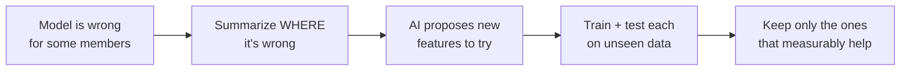

# Which members will be expensive next quarter?

*A real healthcare-cost problem, solved three ways: the tempting "just ask the AI" shortcut,
the machine-learning model that actually holds up, and — the interesting part — **using AI to
make that ML model measurably better**, without ever trusting the AI to grade its own work.*

> **The 30-second version.** A health plan needs to know which members will cost the most in
> the coming months, so it can budget and get help to those people early. You *could* just ask
> an AI chatbot. It'll answer confidently — and you'll have no way to know if it's right. So
> instead we use a proper prediction model, and we bring the AI in for the one thing it's
> genuinely great at: **suggesting ideas**. Every idea it suggests is then tested on real data
> before it's trusted. The AI proposes; the test decides. Here's the whole story.

> 💻 Full code: [`github.com/sarathi-aiml/carecost-fusion-snowflake-vertex`](https://github.com/sarathi-aiml/carecost-fusion-snowflake-vertex).
> *Synthetic data, no real patient information.*

---

## The job

Imagine you work at a health plan — the company that pays members' medical bills. Every doctor
visit, ER trip, hospital stay, and prescription becomes a **claim**: a billed event with a
dollar amount. A **member** is one enrolled person.

Your job: for each member, estimate **how much the plan will pay for them over the next 90
days**. This matters for two very practical reasons:

1. **Money.** The plan has to set aside the right amount to cover upcoming costs.
2. **Care.** A small number of members drive a huge share of spending. If you can flag them
   *early*, a care-management team can reach out before a manageable situation becomes a
   $200,000 hospital stay.

This isn't a made-up scenario. Next-period cost forecasting and **high-cost claimant
identification** are standard, daily practice for payers and actuaries — a small fraction of
members really do drive most of the spend, and finding them early is
[a well-studied problem in the industry](https://www.soa.org/globalassets/assets/files/resources/research-report/2018/2018-predict-high-cost-hcci.pdf).
So the question is simple to state: **who's going to be expensive, and how expensive?**

Let's try to answer it three ways.

---

## Attempt 1 — Just ask the AI

The tempting shortcut in 2025: paste the member's history into a chatbot and ask.

```
You:  Here is member M-04021's claim history for the last 15 months:
      [ 47 claims, mostly primary care and pharmacy, one ER visit in March... ]
      How much will this member cost over the next 90 days?

AI:   Based on the pattern of care, approximately $18,500.
```

Clean, fast, confident. And **you cannot use it.** Here's why:

- **You can't check it.** Where did $18,500 come from? There's no reasoning you can audit, no
  way to know if it's a good guess or a made-up number that *sounds* reasonable.
- **You can't repeat it.** Ask again tomorrow, or reword the prompt, and the number moves.
  Budgets can't be built on an answer that changes.
- **You can't measure it.** To trust any forecasting method, you run it on last year's data and
  check it against what actually happened. A chatbot answering one member at a time gives you
  nothing to score at scale.
- **It doesn't know the base rates.** A good forecaster knows that *most* members cost very
  little and a *few* cost enormous amounts. A chatbot has no calibrated sense of that
  distribution for *your* population.

The AI isn't broken — it's just the wrong tool for this job. Predicting a number you'll be held
accountable for is not a conversation. It's a measurement.

---

## Attempt 2 — Use the right tool: a machine-learning model

Machine learning, in one sentence: instead of asking someone to guess, you **show a program
thousands of past examples and let it learn the pattern** — then you test it on examples it has
never seen.

That last part is the whole point. We don't take the model's word for anything. And because
we're forecasting the *future*, we're careful about how we test: we split the timeline so the
model trains only on the past and is scored on a **later period it has never seen** — never
letting it peek across the date it's predicting from. (Shuffle healthcare data randomly and
you'll leak the future into training and fool yourself; the discipline here is deliberate.)

For our problem we engineer features from each member's history — spend in the last 30, 90, and
180 days, visit counts, ER counts, how many distinct providers — computed with time-windowed SQL
right where the data lives, so nothing leaks and nothing large is copied out
([`sql/01_base_features.sql`](sql/01_base_features.sql)). Then we train gradient-boosted trees
(XGBoost) on the log of cost — healthcare spend is extremely skewed, a handful of members cost
100× the rest — to predict the next 90 days ([`src/modeling.py`](src/modeling.py)).

How good is it? Compare it to the dumbest possible forecast — "just guess the typical member's
cost for everyone":

| Method | Average error (MAE) |
|---|---|
| Guess the median for everyone | **$78,062** |
| The ML model | **$32,829** |

The model is about **2.4× more accurate** — and, unlike the chatbot, that number is measured on
data it never saw. This is why prediction is an ML job, not a chatbot job.

### But the model has a blind spot

Look at two members the model treats as identical:

| Member | Spend last 30 days | Spend last 90 days | Model predicts | What actually happened |
|--------|-------------------:|-------------------:|---------------:|-----------------------:|
| **A — steady** | $5,000 | $15,000 | ~$15,000 | **$14,800** ✅ |
| **B — ramping up** | $8,000 | $15,000 | ~$15,000 | **$28,400** ❌ |

Same 90-day total. The model gives them the same forecast. But member B's spending is
**accelerating** — most of it is recent — and B's actual cost nearly doubles. The model
underpredicts B by about **$13,000**, because the features it has describe *how much* a member
spent, not *which direction they're heading*.

Here's the ML craft that matters: we don't find this blind spot by eyeballing. We do **residual
analysis** — line up every member by how badly the model missed, then let a small, readable
model describe the group it underpredicts most ("members with very high recent visit counts and
cost"). Finding *where a model is systematically wrong, and why* is the skill that separates
tuning a model from actually improving it. And it's exactly the kind of gap a good idea — from a
human or an AI — could close by adding a feature for cost *acceleration*. Which brings us to the
interesting part: **using AI to generate those ideas, and ML to prove them.**

---

## Attempt 3 — Let the AI help the model, but make it prove every idea

Here's the shift in mindset. We stop asking the AI to *give the answer*. We ask it to
**suggest ideas for improving the model** — and then we make each idea earn its place with the
same held-out test we used above.

The flow:



**Step 1 — Find where the model struggles, and summarize it safely.**
We group the members the model underpredicts and describe the group in aggregate — "members
with very high recent visit counts and cost." Crucially, only that **anonymous summary** leaves
our data warehouse ([Snowflake](https://www.snowflake.com/)) — no member records, no names, no
IDs. ([`src/residuals.py`](src/residuals.py))

**Step 2 — Ask the AI for ideas, from a fixed menu.**
We give the AI ([Google's Gemini](https://cloud.google.com/vertex-ai/generative-ai/docs/multimodal/function-calling),
running on Vertex AI) the summary and a short list of *allowed* feature ideas, and ask it to
pick the ones most likely to explain the misses. It can't invent formulas or write code — it
picks from the menu and explains its reasoning. ([`src/gemini_hypothesis.py`](src/gemini_hypothesis.py))

On our problem, Gemini proposed three, confidently:

- **Cost acceleration** — is recent spending running ahead of the member's own average? *(90% confident)*
- **Inpatient cost share** — how much of the cost is hospital stays? *(90% confident)*
- **Provider fragmentation** — is care spread across many different doctors? *(0% confident)*

**Step 3 — Make each idea prove itself.**
This is the part that separates a real result from a confident guess. We take each proposed
feature, add it to the model, retrain, and test on the **same unseen data** — and only keep it
if it measurably lowers the error. The rule is fixed and boring on purpose
([`src/evaluation.py`](src/evaluation.py)):

> Accept the feature **only if it reduces the model's error by at least 1%** and doesn't hurt
> our ability to catch high-cost members. Otherwise, reject it.

The AI gets no vote here. Here's what the test decided:

| Proposed feature | Change in error | Verdict |
|------------------|:---------------:|:-------:|
| **Cost acceleration** | **−1.6%** (clearly better) | ✅ **KEEP** |
| Inpatient cost share | −0.6% (a little better — but under the 1% bar) | ❌ reject |
| Provider fragmentation | +0.6% (worse) | ❌ reject |

Gemini was **90% confident** about "inpatient cost share." It nudged the error down slightly —
but not enough to clear the bar we set — so the test rejected it. That's the whole idea working
exactly as intended: a confident suggestion is not the same as a real, meaningful improvement,
and only the measurement can tell them apart.

### How the model got better

Remember member B — the one the model underpredicted by $13,000? The winning feature is a single
number that finally tells B apart from A:

```
cost acceleration = recent 30-day cost ÷ (prior 90-day average)
member B:  $8,000 ÷ ($15,000 ÷ 3)  =  1.6
member A:  $5,000 ÷ ($15,000 ÷ 3)  =  1.0
```

Member A is steady (1.0). Member B is ramping (1.6). With that clue added, the model stops
treating them the same — and its overall error drops, on data it had never seen. The AI spotted
the *idea*; the test confirmed it was *real*.

---

## What the plan actually gets

Put together, this is a forecasting system a health plan can stand behind:

- A prediction for every member, from a model whose accuracy is **measured, not asserted**.
- A safe way to keep improving it — the AI surfaces ideas humans might miss, and nothing reaches
  the model until it's earned its place on held-out data.
- The sensitive claims data never leaves the governed warehouse; the AI only ever sees an
  anonymous summary.

And a simple principle you can take to any AI project, healthcare or not:

> **Let AI propose. Make the measurement decide. Keep the data governed.**

The failure mode everyone's rushing toward is trusting a confident answer because it sounds
right. The fix isn't to avoid AI — it's to give it the job it's good at (ideas) and give the
job it's bad at (deciding what's true) to something you can actually measure.

---

## How it's built on Vertex AI (for the ML engineers reading)

The story above is deliberately simple, but the plumbing underneath is a full, real
machine-learning lifecycle on **Google Vertex AI** — not a notebook demo. Each piece earns its
place:

- **Gemini with function calling** — the AI doesn't return free text we have to parse and hope
  about; it calls a typed `propose_feature` tool constrained to a whitelist, so its output is
  structured, validated, and impossible to turn into rogue SQL. ([`src/gemini_hypothesis.py`](src/gemini_hypothesis.py))
- **Vertex AI Gen AI Evaluation** — before a proposal ever reaches the ML test, an independent
  autorater scores how well-grounded the AI's *reasoning* is against the evidence, with a custom
  rubric. We don't even take the AI's explanation on faith. ([`src/vertex_geneval.py`](src/vertex_geneval.py))
- **Vertex AI Experiments** — every run (baseline and each challenger) is logged with its params
  and metrics, so the accept/reject decisions have a paper trail. ([`src/vertex_experiments.py`](src/vertex_experiments.py))
- **Vertex Model Registry** — the winning model is versioned and cataloged; only a tiny model
  artifact leaves Snowflake, never the data. ([`src/vertex_registry.py`](src/vertex_registry.py))
- **Online Endpoint + Explainable AI** — the champion is served for real-time scoring with
  per-feature attributions, so a prediction comes with a "why." ([`src/vertex_prediction.py`](src/vertex_prediction.py))
- **Vertex AI Pipelines (KFP)** — the whole loop (features → baseline → propose → test → register)
  runs as an orchestrated, reproducible pipeline. ([`src/vertex_pipeline.py`](src/vertex_pipeline.py))

Two platforms, each doing what it's best at: **Snowflake** governs the data and does the SQL
feature engineering; **Vertex AI** runs the model lifecycle and the AI-assisted feature
discovery. The full design is in [`ARCHITECTURE.md`](ARCHITECTURE.md); the
[code](https://github.com/sarathi-aiml/carecost-fusion-snowflake-vertex) is readable end to end.

*The real takeaway isn't the LLM. It's the combination: **strong, measured ML as the backbone,
and AI used to make it better** — proposing what a human might miss, while every idea still has
to prove itself on data the model has never seen.*
