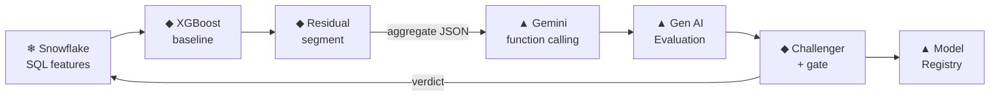

# Gemini proposes. XGBoost proves. Snowflake governs.

*A hybrid Snowflake × Google Vertex AI pipeline where a language model suggests
features — and a holdout ML gate, not the model, decides. Follow one member all the
way through.*

> 💻 **Code:** `https://github.com/sarathi-aiml/carecost-fusion-snowflake-vertex`
> — every step below links to the file that implements it, so you can follow along in the repo.
> Design spec: [`SPEC.md`](SPEC.md).

> **Why this instead of another chatbot demo?** Most GenAI portfolios are RAG bots and
> agents. This one is deliberately **traditional ML** — an XGBoost baseline, **residual
> analysis**, champion/challenger experiments, and a holdout gate — with an LLM in a
> disciplined *supporting* role. The interesting engineering is the ML rigor *around* the
> model, not the model call itself.

---

## The problem, with actual numbers

We're predicting each member's **next-90-day healthcare cost**. A plain XGBoost model
does fine on average — **MAE $32,829 vs. a median baseline of $78,062 (~2.4× better)**.

But look at two members our features see as *identical*:

| member | COST_30D | COST_90D | model predicts | actual next-90d |
|--------|---------:|---------:|---------------:|----------------:|
| **A — steady** | $5,000 | $15,000 | ~$15,000 | **$14,800** ✅ |
| **B — accelerating** | $8,000 | $15,000 | ~$15,000 | **$28,400** ❌ |

Same 90-day spend. The model gives them the same prediction. But B's cost is
**accelerating** — recent 30-day spend is running way ahead of the prior average — and
B's real future cost nearly doubles. The model **underpredicts B by ~$13k** and has no
way to see it coming, because its features capture the *level* of cost, not the
*trajectory*.

That's a real residual pattern. The obvious fix is "add an acceleration feature." But
here's the trap that this whole project is about:

> **A language model can *suggest* that feature. It cannot tell you whether the feature
> actually helps.** Confidence is not evidence.

So we build a system where **Gemini proposes**, and a **holdout experiment proves**.

## The flow



Now walk it, one step at a time, with the sample data — and the Vertex code.

---

### Step 1 — Snowflake computes the features (and the trap)

📄 [`sql/01_base_features.sql`](sql/01_base_features.sql)

**Problem it solves:** compute features where the data lives, with no future leakage,
and *deliberately leave out* the acceleration ratio so there's a signal to discover.

The window aggregation runs in-warehouse. The mandatory rule:

```sql
-- history features:   SERVICE_DATE <  INDEX_DATE
-- target (the label): INDEX_DATE <= SERVICE_DATE < DATEADD(day, 90, INDEX_DATE)
SUM(IFF(SERVICE_DATE >= DATEADD(day, -30, INDEX_DATE), PAID_AMOUNT, 0)) AS COST_30D,
SUM(IFF(SERVICE_DATE >= DATEADD(day, -90, INDEX_DATE), PAID_AMOUNT, 0)) AS COST_90D,
```

For member B this yields `COST_30D=$8,000, COST_90D=$15,000` — but **not**
`COST_ACCELERATION`. That omission is the point.

### Step 2 — XGBoost baseline underpredicts B

📄 [`src/modeling.py`](src/modeling.py)

**Problem it solves:** an honest, leakage-free baseline to beat, and a residual to mine.

Trained on `log1p(cost)` with a chronological 60/20/20 split. It predicts ~$15k for both
A and B. B's actual is $28.4k → a **+$13k residual**. Multiply across a segment and you
have a systematic error.

### Step 3 — Find the error segment, send only aggregates

📄 [`src/residuals.py`](src/residuals.py)

**Problem it solves:** turn thousands of member-level residuals into one interpretable,
*privacy-safe* description an LLM can reason about.

A depth-3 decision tree isolates the worst-underprediction leaf. Only this leaves
Snowflake — **no member rows, no IDs**:

```json
{
  "segment_description": "high recent claim count and cost",
  "member_count": 95,
  "mean_residual": 560138.73,
  "conditions": ["CLAIM_COUNT_90D > 258.50", "COST_180D > 343955.95"],
  "allowed_feature_families": ["COST_ACCELERATION", "PROVIDER_FRAGMENTATION",
                               "ED_ACCELERATION", "INPATIENT_COST_SHARE"]
}
```

### Step 4 — Gemini proposes, via function calling (Vertex)

📄 [`src/gemini_hypothesis.py`](src/gemini_hypothesis.py)

**Problem it solves:** get the LLM's ideas *without* letting it free-text SQL or invent
columns. Gemini doesn't return prose — it **calls a tool** bound to a whitelist.

```python
from google import genai
from google.genai import types

propose = types.FunctionDeclaration(
    name="propose_feature",
    description="Propose one testable derived feature from the allowed whitelist.",
    parameters={"type": "OBJECT", "properties": {
        "feature_name": {"type": "STRING", "enum": ["COST_ACCELERATION",
            "PROVIDER_FRAGMENTATION", "ED_ACCELERATION", "INPATIENT_COST_SHARE"]},
        "hypothesis": {"type": "STRING"},
        "confidence": {"type": "NUMBER"}}, "required": ["feature_name", "hypothesis", "confidence"]})

client = genai.Client(vertexai=True, project=PROJECT, location="us-central1")
resp = client.models.generate_content(
    model="gemini-2.5-flash",
    contents=PROMPT.format(evidence=json.dumps(residual_summary)),
    config=types.GenerateContentConfig(
        tools=[types.Tool(function_declarations=[propose])],
        tool_config=types.ToolConfig(
            function_calling_config=types.FunctionCallingConfig(mode="ANY"))))

for call in resp.function_calls:      # structured, typed — not a string to parse
    print(call.name, dict(call.args))
```

Real output on our segment:

```
propose_feature {'feature_name': 'COST_ACCELERATION',        'confidence': 0.90, 'hypothesis': 'Rapid recent cost growth...'}
propose_feature {'feature_name': 'INPATIENT_COST_SHARE',      'confidence': 0.90, 'hypothesis': 'High inpatient share...'}
propose_feature {'feature_name': 'PROVIDER_FRAGMENTATION',    'confidence': 0.00, 'hypothesis': 'Fragmented care...'}
```

The formula and the safe math live in *our* code — Gemini only picks names.
📖 [Vertex function calling](https://cloud.google.com/vertex-ai/generative-ai/docs/multimodal/function-calling)

### Step 5 — Score the hypotheses independently (Vertex Gen AI Evaluation)

📄 [`src/vertex_geneval.py`](src/vertex_geneval.py)

**Problem it solves:** "the LLM's confidence doesn't count." So an *autorater* scores each
hypothesis against the evidence with a rubric I authored — not the model grading itself.

```python
from vertexai.evaluation import EvalTask, PointwiseMetric, PointwiseMetricPromptTemplate

metric = PointwiseMetric(metric="hypothesis_plausibility",
    metric_prompt_template=PointwiseMetricPromptTemplate(
        criteria={"plausibility": "Plausible mechanism for the underprediction?",
                  "relevance": "Relevant to the described segment?"},
        rating_rubric={"5": "highly plausible + relevant", "3": "partial", "1": "no"},
        input_variables=["prompt", "response"]))

table = EvalTask(dataset=df, metrics=[metric]).evaluate().metrics_table
```

📖 [Gen AI Evaluation Service](https://cloud.google.com/vertex-ai/generative-ai/docs/models/evaluation-overview)

### Step 6 — The gate decides (this is the whole point)

📄 [`src/evaluation.py`](src/evaluation.py)

**Problem it solves:** replace "the model sounded confident" with a measurable holdout
test. Each accepted feature becomes a challenger — same split, same params, one new column.

```python
def decide_challenger(baseline, challenger, min_mae_improvement_pct=1.0, max_recall_drop=0.02):
    mae_improvement = (baseline["mae"] - challenger["mae"]) / baseline["mae"] * 100
    recall_drop     = baseline["high_cost_recall"] - challenger["high_cost_recall"]
    if mae_improvement < min_mae_improvement_pct: return "REJECT", "MAE gain below threshold"
    if recall_drop > max_recall_drop:             return "REVIEW", "recall regressed"
    return "ACCEPT", "holdout metrics passed"
```

The verdict at seed 42:

| feature | MAE | improvement | decision |
|---------|----:|------------:|:--------:|
| **COST_ACCELERATION** | $32,297 | **+1.62%** | **ACCEPT** |
| PROVIDER_FRAGMENTATION | $33,022 | −0.59% | REJECT |
| INPATIENT_COST_SHARE | $32,646 | +0.56% | REJECT |

Gemini proposed three plausible ideas with high confidence. The holdout **accepted the
one that actually captured member B's trajectory and rejected the other two.** For member
B, `COST_ACCELERATION = 8000 / (15000/3) = 1.6` — the single number that told the model B
was different from A. That's the problem from the top, solved.

### Step 7 — Track every run + version the champion (Vertex)

📄 [`src/vertex_experiments.py`](src/vertex_experiments.py) · [`src/vertex_registry.py`](src/vertex_registry.py)

**Problem it solves:** provenance. Every run is in one ledger; the winning model is
cataloged — but only a **KB artifact** leaves Snowflake, never the data.

```python
from google.cloud import aiplatform
aiplatform.init(project=PROJECT, location="us-central1", experiment="carecost-fusion")
with aiplatform.start_run("challenger-cost-acceleration"):
    aiplatform.log_params({"feature_name": "COST_ACCELERATION"})
    aiplatform.log_metrics({"mae": 32297.0, "mae_improvement_pct": 1.62})

aiplatform.Model.upload(display_name="carecost-champion", artifact_uri=gcs_dir,
    serving_container_image_uri="us-docker.pkg.dev/vertex-ai/prediction/xgboost-cpu.2-1:latest")
```

📖 [Experiments](https://cloud.google.com/vertex-ai/docs/experiments/intro-vertex-ai-experiments) ·
[Model Registry](https://cloud.google.com/vertex-ai/docs/model-registry/introduction)

### Step 8 — Serve it with an explanation (Vertex Endpoint + Explainable AI)

📄 [`src/vertex_prediction.py`](src/vertex_prediction.py)

**Problem it solves:** real-time scoring plus a "why did it say $X" answer for a customer.

```python
endpoint = model.deploy(machine_type="n1-standard-2", min_replica_count=1)
endpoint.predict(instances=[member_vector])     # live: $151,099 (actual $132,946)
endpoint.explain(instances=[member_vector])     # sampled-Shapley feature attributions
```

📖 [Explainable AI](https://cloud.google.com/vertex-ai/docs/explainable-ai/overview)

### Step 9 — Orchestrate the whole thing (Vertex AI Pipeline)

📄 [`src/vertex_pipeline.py`](src/vertex_pipeline.py)

**Problem it solves:** make it reproducible and hand-off-able — the answer to "walk me
through an ML pipeline on Vertex." Each step is a KFP component installing the project as
a versioned wheel; artifacts flow downstream.

```python
@dsl.pipeline(name="carecost-fusion-pipeline")
def carecost_pipeline(project: str, member_count: int = 2000):
    f = gen_features(member_count=member_count)
    b = baseline_segment(features=f.outputs["features"])
    g = gemini_propose(segment=b.outputs["segment"], project=project)
    c = challengers_gate(features=f.outputs["features"], accepted=g.outputs["accepted"])
    register_champion(champion=c.outputs["champion"], project=project)
```

This runs on Vertex end-to-end and registers a champion — verified green. 📖
[Vertex AI Pipelines](https://cloud.google.com/vertex-ai/docs/pipelines/introduction)

---

## How Vertex AI is used, at a glance

| Vertex service | Role here | Snippet |
|---|---|---|
| **Gemini + function calling** | propose features within a whitelist | Step 4 |
| **Gen AI Evaluation** | score hypotheses independently | Step 5 |
| **Experiments + ML Metadata** | one run ledger + lineage | Step 7 |
| **Model Registry** | versioned champion, tiny artifact | Step 7 |
| **Endpoint + Explainable AI** | serve + attribute | Step 8 |
| **Vertex AI Pipeline (KFP)** | orchestrate the DAG | Step 9 |

Snowflake owns the data + SQL features + governance; XGBoost owns the prediction and the
decision. Vertex owns everything ML-lifecycle around the model.

## Snowflake and Vertex, each doing what it's great at

Snowflake is the governed home for the data and the SQL feature engineering — the
analytical system of record, and where I'd keep the heavy lifting. In this project the
Gemini output happens to be an *ML-lifecycle artifact* — tool-constrained, independently
evaluated, versioned, and gated right alongside the model it feeds — so it naturally sits
with the rest of the ML lifecycle on Vertex. Two strong platforms, each doing what it's
best at, with a clean, aggregate-only boundary between them.

## Takeaway

The engineering that matters isn't "we used an LLM." It's the **contract** around it:
propose within a whitelist, prove on a holdout, govern the data in the warehouse. Member B
is why — a confident suggestion and a real improvement are not the same thing, and only the
holdout can tell them apart.

*Full code, architecture, and a step-by-step quick start are in the repo.*
