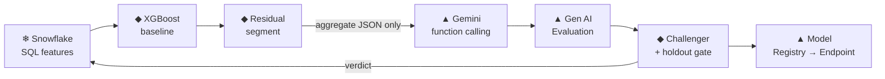

# Gemini proposes. XGBoost proves. Snowflake governs.

*A hybrid Snowflake × Google Vertex AI pipeline where a language model suggests
features — and a holdout ML gate, not the model, decides which ones are real. We'll
follow a single health-plan member all the way through.*

> 💻 **Code:** [`github.com/sarathi-aiml/carecost-fusion-snowflake-vertex`](https://github.com/sarathi-aiml/carecost-fusion-snowflake-vertex)
> — every step below links to the exact file that implements it, so you can read the code
> as you read the story. Design spec: [`SPEC.md`](SPEC.md) · architecture: [`ARCHITECTURE.md`](ARCHITECTURE.md).

> **Why read this if you've seen a hundred GenAI demos?** Most GenAI portfolios are RAG
> bots and agents. This one is deliberately **traditional ML** — an XGBoost baseline,
> residual analysis, champion/challenger experiments, and a holdout gate — with a language
> model in a disciplined *supporting* role. The interesting engineering isn't the model
> call. It's the **contract** we build around it so a confident suggestion can't sneak into
> production unproven.

---

## First, the domain in one paragraph

If you don't work in healthcare, here's everything you need. A health plan (the "payer")
pays for its members' care. Every doctor visit, ER trip, hospital stay, or prescription
generates a **claim** — a billed event with a dollar amount the plan paid. A **member** is
one enrolled person. Our job is to predict each member's **next-90-day cost**: the total
dollars the plan will pay for them over the coming quarter. Payers and actuaries forecast
this constantly — to set reserves, budget, and flag **high-cost members** early enough for a
care-management team to intervene. High-cost members are rare but dominate spend; in the
research literature high-cost claimants drive roughly [9% of members but a
disproportionate share of dollars](https://www.soa.org/globalassets/assets/files/resources/research-report/2018/2018-predict-high-cost-hcci.pdf),
and the single most predictive signal is a member's own cost history. That's the whole
setup. Now the ML.

---

## The problem, with real numbers

We train a plain XGBoost model — gradient-boosted trees, the workhorse for tabular
prediction — on member history to predict next-90-day cost. On average it does well:

- **XGBoost MAE: \$32,829** (mean absolute error — the model is off by ~\$33k per member on average)
- **Median-guess baseline MAE: \$78,062** (just predict the training median for everyone)
- So XGBoost is **~2.4× better than guessing**. A respectable baseline.

But averages hide the members who matter. Look at two members whose features are, to the
model, **identical**:

| member | last 30 days (`COST_30D`) | last 90 days (`COST_90D`) | model predicts | actual next 90 days |
|--------|--------------------------:|--------------------------:|---------------:|--------------------:|
| **A — steady** | \$5,000 | \$15,000 | ~\$15,000 | **\$14,800** ✅ |
| **B — accelerating** | \$8,000 | \$15,000 | ~\$15,000 | **\$28,400** ❌ |

Same 90-day spend, so the model gives them the same forecast. But member B is
**accelerating** — the most recent 30 days (\$8k) are running well ahead of B's own prior
monthly pace (\$15k over 90 days ≈ \$5k/month). B's real future cost nearly doubles. The
model **underpredicts B by ~\$13k** and never sees it coming, because every feature it has
captures the *level* of spend, not the *trajectory*.

> **Underprediction** (a positive residual: `actual − predicted > 0`) is the expensive kind
> of error for a payer. Predict too low for member B and you under-reserve for exactly the
> person who's about to get expensive — and you don't flag them for care management.

The obvious fix is "add an acceleration feature." And here's the trap this entire project
is built around:

> **A language model can *suggest* that feature. It cannot tell you whether the feature
> actually helps. Confidence is not evidence.**

So we build a system with a strict division of labor:

**Gemini proposes. A holdout experiment proves. Snowflake governs the data.**

---

## The flow



Each box is one step below, with the file that implements it, a snippet that matches the
real code, and the running member-B example. Nine steps, end to end.

---

### Step 1 — Snowflake computes the features (and deliberately leaves a gap)

📄 [`sql/01_base_features.sql`](sql/01_base_features.sql)

**What it does:** computes member history features where the data already lives — in the
warehouse — with a strict no-future-leakage boundary. **Why it matters:** if a feature
accidentally peeks at the 90-day window we're trying to predict, the model looks brilliant
in testing and fails in production. The boundary is a one-line rule, enforced in SQL:

```sql
-- history features:   SERVICE_DATE <  INDEX_DATE
-- target (the label): INDEX_DATE <= SERVICE_DATE < DATEADD(day, 90, INDEX_DATE)
SUM(IFF(c.SERVICE_DATE >= DATEADD(day, -30, g.INDEX_DATE), c.PAID_AMOUNT, 0)) AS COST_30D,
SUM(IFF(c.SERVICE_DATE >= DATEADD(day, -90, g.INDEX_DATE), c.PAID_AMOUNT, 0)) AS COST_90D,
```

The window aggregation runs in-warehouse — this is exactly what a SQL engine is great at,
and it keeps the claim-level data home. For member B this yields `COST_30D=$8,000,
COST_90D=$15,000` — but **not** a `COST_ACCELERATION` ratio. That omission is intentional:
it's the gap we want the rest of the pipeline to *discover* rather than be handed.

> **Governance angle:** only member-level *feature* rows ever leave the warehouse for
> training, and — as you'll see in Step 3 — only an *aggregate* summary is ever exposed to
> the LLM. The raw claims never move.

---

### Step 2 — The XGBoost baseline underpredicts B

📄 [`src/modeling.py`](src/modeling.py)

**What it does:** trains an honest baseline to beat, and produces the residuals we'll mine.
**Why it matters:** every improvement in this project is measured *against* this model on
data it never saw.

Two details make the baseline trustworthy:

- **Chronological 60/20/20 split.** We sort by `INDEX_DATE` and train on the earliest 60%,
  validate on the next 20%, test on the most recent 20% — never a random split. You cannot
  learn from a member's future to predict their past, so the test set is always *later* in
  time than the training set.
- **Log-target training.** Healthcare cost is heavily right-skewed (a few members cost
  100× the median), so we train on `log1p(cost)` and invert with `expm1` + clip at zero.

```python
def train_predict(split, feature_cols, model_cfg):
    model = make_model(model_cfg)                       # identical params for every run
    model.fit(split.train[feature_cols], np.log1p(split.train[TARGET].to_numpy()))
    pred = np.expm1(model.predict(split.test[feature_cols]))
    return model, np.clip(pred, 0, None)
```

It predicts ~\$15k for both A and B. B's actual is \$28.4k → a **+\$13k residual**. One
member is an anecdote; the same error repeated across a segment is a systematic blind spot.

---

### Step 3 — Find the error segment, and send only aggregates

📄 [`src/residuals.py`](src/residuals.py)

**What it does:** turns thousands of member-level residuals into one interpretable,
*privacy-safe* description a language model can reason about. **Why it matters:** this is
the data boundary. We want the LLM's ideas without ever showing it a member.

A depth-3 `DecisionTreeRegressor` isolates the leaf with the worst systematic
underprediction, and we serialize only that leaf's aggregate stats and human-readable
split conditions:

```python
tree = DecisionTreeRegressor(max_depth=3, min_samples_leaf=30, random_state=0).fit(X, y)
# ... walk root→leaf, collect the split conditions, aggregate the members in the leaf
```

The **only** object that crosses to Google Cloud — no member rows, no IDs, no claims:

```json
{
  "segment_description": "Segment where: CLAIM_COUNT_90D > 258.50; COST_180D > 343955.95",
  "member_count": 95,
  "mean_residual": 560138.73,
  "conditions": ["CLAIM_COUNT_90D > 258.50", "COST_180D > 343955.95"],
  "allowed_feature_families": ["COST_ACCELERATION", "PROVIDER_FRAGMENTATION",
                               "ED_ACCELERATION", "INPATIENT_COST_SHARE"]
}
```

Read that in plain terms: *"95 members with very high recent claim counts and cost are
being under-forecast by a large margin — here are four families of feature you're allowed
to propose."* That's all the LLM ever sees.

---

### Step 4 — Gemini proposes, through function calling

📄 [`src/gemini_hypothesis.py`](src/gemini_hypothesis.py)

**What it does:** gets Gemini's feature ideas *without* letting it free-text SQL, invent
column names, or grade its own work. **Why it matters:** an LLM that returns prose forces
you to parse and trust a string. An LLM constrained to a **tool call** returns typed,
whitelisted, machine-checkable structure.

The mechanism is [**function calling**](https://cloud.google.com/vertex-ai/generative-ai/docs/multimodal/function-calling):
we declare a `propose_feature` function whose `feature_name` argument is an `enum` bound to
our whitelist, and set `mode="ANY"` so the model *must* answer by calling the tool rather
than replying with text.

```python
from google import genai
from google.genai import types

propose = types.FunctionDeclaration(
    name="propose_feature",
    description="Propose one testable derived feature from the allowed whitelist.",
    parameters={"type": "OBJECT", "properties": {
        "feature_name": {"type": "STRING", "enum": list(ALLOWED_FEATURE_NAMES)},
        "hypothesis":   {"type": "STRING"},
        "confidence":   {"type": "NUMBER"}},
        "required": ["feature_name", "hypothesis", "confidence"]})

client = genai.Client(vertexai=True, project=PROJECT, location="us-central1")
resp = client.models.generate_content(
    model="gemini-2.5-flash",
    contents=PROMPT.format(evidence=json.dumps(residual_summary, indent=2)),
    config=types.GenerateContentConfig(
        tools=[types.Tool(function_declarations=[propose])],
        tool_config=types.ToolConfig(
            function_calling_config=types.FunctionCallingConfig(mode="ANY"))))

for call in resp.function_calls:      # structured + typed — not a string to parse
    print(call.name, dict(call.args))
```

Real output on our segment:

```
propose_feature {'feature_name': 'COST_ACCELERATION',   'confidence': 0.90, 'hypothesis': 'Rapid recent cost growth...'}
propose_feature {'feature_name': 'INPATIENT_COST_SHARE', 'confidence': 0.90, 'hypothesis': 'High inpatient share...'}
propose_feature {'feature_name': 'PROVIDER_FRAGMENTATION','confidence': 0.00, 'hypothesis': 'Fragmented care...'}
```

Note that Gemini is **90% confident** in two ideas — `COST_ACCELERATION` *and*
`INPATIENT_COST_SHARE`. Hold that thought; it's the whole point of Step 6. And notice what
Gemini never does: it never writes the formula. The safe math (including the divide-by-zero
guards) lives in *our* [`feature_catalog.py`](src/feature_catalog.py) — Gemini only picks a
name from the menu.

> **Plain-language sidebar — what is function calling?** Instead of asking the model an
> open question and hoping the answer is well-formed, you hand it a set of buttons it's
> allowed to press, each with typed fields. The model chooses which button and fills the
> fields; you get structured data back, not free text you have to trust and parse. `mode:
> ANY` means "you must press a button, no chatting."

---

### Step 5 — Score each hypothesis independently (Gen AI Evaluation)

📄 [`src/vertex_geneval.py`](src/vertex_geneval.py)

**What it does:** scores each hypothesis against the evidence with a rubric I authored —
*not* the model grading itself. **Why it matters:** the project's thesis is "the LLM's own
confidence doesn't count." An independent scorer is a second opinion that Gemini can't
tilt.

The [Vertex Gen AI Evaluation Service](https://cloud.google.com/vertex-ai/generative-ai/docs/models/evaluation-overview)
runs a separate judge model (an *autorater*) against a
[`PointwiseMetric`](https://cloud.google.com/vertex-ai/generative-ai/docs/models/eval-python-sdk/determine-eval)
— a custom metric where *you* define the criteria and the 1-to-5 rating rubric:

```python
from vertexai.evaluation import EvalTask, PointwiseMetric, PointwiseMetricPromptTemplate

metric = PointwiseMetric(metric="hypothesis_plausibility",
    metric_prompt_template=PointwiseMetricPromptTemplate(
        criteria={"plausibility": "Plausible mechanism for the underprediction?",
                  "relevance":    "Relevant to the described segment?"},
        rating_rubric={"5": "highly plausible + relevant", "3": "partial", "1": "no"},
        input_variables=["prompt", "response"]))

table = EvalTask(dataset=df, metrics=[metric]).evaluate().metrics_table
```

One deliberate design note that's in the code comments: we grade **plausibility +
relevance**, not `GROUNDEDNESS`. A hypothesis by definition extrapolates *beyond* the
evidence, so a strict groundedness score would be ~0 for every candidate and tell us
nothing. Plausibility differentiates them. This is a secondary signal on *idea quality* —
it is still **not** the decision. The decision is Step 6.

> **Plain-language sidebar — what is an autorater?** A separate LLM acting as a judge,
> scoring text against a fixed rubric you wrote. It's how you get a repeatable "how good is
> this answer, 1–5?" without a human in the loop for every run.

---

### Step 6 — The holdout gate decides (this is the whole project)

📄 [`src/evaluation.py`](src/evaluation.py)

**What it does:** replaces "the model sounded confident" with a measurable experiment. Each
proposed feature becomes a **challenger**: the exact same split, the exact same
hyperparameters, **one new column**. Train it, score it on the untouched test period, and
apply a deterministic gate.

```python
def decide_challenger(baseline, challenger, min_mae_improvement_pct, max_recall_drop):
    mae_improvement_pct = (baseline["mae"] - challenger["mae"]) / baseline["mae"] * 100.0
    recall_drop         = baseline["high_cost_recall"] - challenger["high_cost_recall"]
    if mae_improvement_pct < min_mae_improvement_pct:  return "REJECT", "MAE gain below threshold"
    if recall_drop        > max_recall_drop:           return "REVIEW", "high-cost recall regressed"
    return "ACCEPT", "holdout metrics passed"
```

The thresholds (`min_mae_improvement_pct=1.0`, `max_recall_drop=0.02`) come from
[`config.example.yaml`](config.example.yaml), not from Gemini. There are two bars, because
overall error and the *high-cost members* are different concerns:

- **MAE improvement ≥ 1.0%** — did average dollar error actually drop enough to bother?
- **High-cost recall drop ≤ 2 points** — of the members who *are* high-cost, are we still
  catching the same fraction in our top-risk group? A feature that lowers average error but
  *loses* high-cost members gets `REVIEW`, not `ACCEPT`.

The verdict, at seed 42:

| feature | Gemini said | MAE | improvement | high-cost recall | decision |
|---------|:-----------:|----:|------------:|:----------------:|:--------:|
| **COST_ACCELERATION** | 0.90 conf | **\$32,297** | **+1.62%** | 0.924 | **ACCEPT** ✅ |
| INPATIENT_COST_SHARE | 0.90 conf | \$32,646 | +0.56% | 0.925 | REJECT |
| PROVIDER_FRAGMENTATION | 0.00 conf | \$33,022 | −0.59% | 0.924 | REJECT |

Here is the punchline. **Gemini was 90% confident in `INPATIENT_COST_SHARE` too** — and the
holdout rejected it anyway, because +0.56% didn't clear the 1.0% bar. Model confidence and
real improvement are *not* the same thing, and only the holdout can tell them apart. The one
feature that survived is the one that actually encodes member B's trajectory:

> For member B, `COST_ACCELERATION = 8000 / max(15000/3, 1) = 8000 / 5000 = 1.6` — the
> single number that finally tells the model B is not A. That's the problem from the top of
> this post, solved by evidence rather than by eloquence.

---

### Step 7 — Track every run, version the champion

📄 [`src/vertex_experiments.py`](src/vertex_experiments.py) · [`src/vertex_registry.py`](src/vertex_registry.py)

**What it does:** provenance. Every run — median baseline, XGBoost baseline, and each
challenger — lands in one ledger, and the winning model is cataloged with its metrics and
verdict. **Why it matters:** six months later, "why is this the champion?" has a
click-through answer instead of a shrug.

[Vertex AI Experiments](https://cloud.google.com/vertex-ai/docs/experiments/intro-vertex-ai-experiments)
is the run ledger; [Vertex Model Registry](https://cloud.google.com/vertex-ai/docs/model-registry/introduction)
is the versioned catalog:

```python
from google.cloud import aiplatform
aiplatform.init(project=PROJECT, location="us-central1", experiment="carecost-fusion")

with aiplatform.start_run("challenger-cost-acceleration"):
    aiplatform.log_params({"feature_name": "COST_ACCELERATION", "random_seed": 42})
    aiplatform.log_metrics({"mae": 32297.0, "mae_improvement_pct": 1.62})

# register only the champion — a KB-sized booster, never the data
aiplatform.Model.upload(display_name="carecost-next90d-cost", artifact_uri=gcs_dir,
    serving_container_image_uri="us-docker.pkg.dev/vertex-ai/prediction/xgboost-cpu.2-1:latest")
```

What crosses to Google Cloud here is a **KB-sized `model.bst` artifact** — the trained
booster — and nothing else. The training data stays in the warehouse. (One small serving
gotcha the code handles: the prebuilt XGBoost container sends *positional* feature vectors,
so [`vertex_registry.py`](src/vertex_registry.py) strips the booster's feature names before
saving, or serving rejects the request.)

---

### Step 8 — Serve it with an explanation (Endpoint + Explainable AI)

📄 [`src/vertex_prediction.py`](src/vertex_prediction.py)

**What it does:** real-time scoring, plus a "why did it say \$X?" answer for every
prediction. **Why it matters:** a payer's care team won't act on a black-box number for a
member; they need to see which signals drove it.

We deploy the champion to a Vertex Online Endpoint configured for
[Explainable AI](https://cloud.google.com/vertex-ai/docs/explainable-ai/overview) with
[**sampled Shapley** feature attributions](https://cloud.google.com/vertex-ai/docs/explainable-ai/configuring-explanations-feature-based):

```python
endpoint = model.deploy(machine_type="n1-standard-2", min_replica_count=1)
endpoint.predict(instances=[member_vector])     # live: $151,099  (actual $132,946)
endpoint.explain(instances=[member_vector])     # per-feature attributions
```

On a live member the endpoint returned **\$151,099** against an actual of **\$132,946** —
in range for a genuinely high-cost member — and `explain()` returns the per-feature
contribution behind it.

> **Plain-language sidebar — what is sampled Shapley?** Shapley values come from game theory:
> they fairly split "credit" for a prediction across the input features. Computing them
> exactly is exponential, so *sampled* Shapley estimates them from a limited number of
> feature-subset permutations (`path_count`, an integer from 1–50). The output: "of the
> \$151k forecast, this much came from `COST_ACCELERATION`, this much from `COST_90D`…"

---

### Step 9 — Orchestrate the whole thing (Vertex AI Pipeline)

📄 [`src/vertex_pipeline.py`](src/vertex_pipeline.py)

**What it does:** wraps the entire flow in a reproducible, hand-off-able DAG. **Why it
matters:** "walk me through your ML pipeline" should have a *runnable* answer, not a
whiteboard drawing.

Built on [Vertex AI Pipelines](https://cloud.google.com/vertex-ai/docs/pipelines/introduction)
(KFP — Kubeflow Pipelines). Each step is a lightweight `@component` that runs in its own
container, installs the project as a versioned wheel from GCS, and calls the same `src`
modules the app uses; artifacts flow downstream:

```python
@dsl.pipeline(name="carecost-fusion-pipeline")
def carecost_pipeline(wheel_uri: str = WHEEL_URI, member_count: int = 2000, seed: int = 42,
                      project: str = PROJECT, gemini_model: str = "gemini-2.5-flash"):
    f = gen_features(wheel_uri=wheel_uri, member_count=member_count, seed=seed)
    b = baseline_segment(wheel_uri=wheel_uri, features=f.outputs["features"])
    g = gemini_propose(wheel_uri=wheel_uri, segment=b.outputs["segment"], project=project)
    c = challengers_gate(wheel_uri=wheel_uri, features=f.outputs["features"], accepted=g.outputs["accepted"])
    register_champion(wheel_uri=wheel_uri, champion=c.outputs["champion"], project=project)
```

It runs on Vertex end to end and registers a champion. One honest note the code is explicit
about: Google's pipeline compute runs from IPs that aren't on the Snowflake network
allowlist, so the *pipeline* uses the deterministic synthetic-feature path, while the live
Snowflake source is exercised by the app and notebook. Wiring the pipeline to the warehouse
directly (Cloud NAT + a reserved, allowlisted egress IP) is first on the productionization
list in [`ARCHITECTURE.md`](ARCHITECTURE.md).

---

## How Vertex AI is used, at a glance

| Vertex service | Role in this project | Step |
|---|---|:---:|
| **Gemini + function calling** | propose features within a typed whitelist | 4 |
| **Gen AI Evaluation (PointwiseMetric)** | independently score hypothesis quality | 5 |
| **Experiments + ML Metadata** | one run ledger with params, metrics, lineage | 7 |
| **Model Registry** | versioned champion, KB-sized artifact | 7 |
| **Online Endpoint + Explainable AI** | serve + attribute with sampled Shapley | 8 |
| **Vertex AI Pipelines (KFP)** | orchestrate the whole DAG reproducibly | 9 |

## Snowflake and Vertex, each doing what it's great at

This is a hybrid architecture on purpose, and the boundary is clean.

**Snowflake is the governed home for the data and the SQL feature engineering** — the
analytical system of record, and where the heavy lifting belongs. Window aggregation over
claims is exactly what a SQL engine is built for, and keeping the claim-level data in the
warehouse is the governance story for a healthcare-shaped workload. For LLM work that lives
*inside* a SQL/analytics workflow, Snowflake Cortex is an excellent, data-local fit.

**In this project the Gemini output happens to be an *ML-lifecycle artifact*** — it's
tool-constrained, independently evaluated, versioned, and gated right alongside the model it
feeds. So it naturally sits with the rest of the ML lifecycle (training, evaluation,
registry, serving, orchestration) on Vertex. Two strong platforms, each doing what it's
best at, with a deliberately narrow boundary between them:

| | Snowflake (data + analytics) | Vertex AI (this project's ML lifecycle) |
|---|---|---|
| Owns | claims, SQL features, results, governance | Gemini, Gen AI Eval, Experiments, Registry, serving |
| Best-fit LLM use | in-SQL/analytics enrichment (Cortex) | tool-constrained, evaluated, versioned, gated |
| What crosses the boundary | keeps the raw data | receives only aggregate JSON + a KB artifact |

## What I'd productionize next

This is a weekend MVP, and it's honest about that. The next steps, from
[`ARCHITECTURE.md`](ARCHITECTURE.md):

- Make Snowflake the single feature source (Dynamic Tables / Feature Store) and give the
  Vertex Pipeline warehouse access via Cloud NAT + a reserved, allowlisted egress IP.
- Add Vertex **Model Monitoring** on the endpoint (training-serving skew + drift).
- Add **Vizier** hyperparameter tuning as a pipeline step.
- Promote the champion by *alias*, not redeploy; compile + run the pipeline on every PR.
- Swap synthetic data for Synthea / CMS DE-SynPUF via the pluggable generator.

## Takeaway

The engineering that matters here isn't "we used an LLM." It's the **contract** around it:

1. **Propose within a whitelist.** Gemini names a feature via a typed tool call — it never
   writes SQL, invents columns, or grades itself.
2. **Prove on a holdout.** A deterministic gate on a temporal test set — not model
   confidence — decides ACCEPT / REJECT / REVIEW.
3. **Govern the data in the warehouse.** Only an aggregate residual summary and a KB-sized
   model artifact ever leave Snowflake.

Member B is the reason all three exist. A confident suggestion and a real improvement are
not the same thing — Gemini was 90% sure about a feature the holdout threw out — and only
the experiment can tell them apart. *Gemini proposes. XGBoost proves. Snowflake governs.*

*Full code, architecture, cost breakdown, and a step-by-step quick start are in the
[repo](https://github.com/sarathi-aiml/carecost-fusion-snowflake-vertex).*
